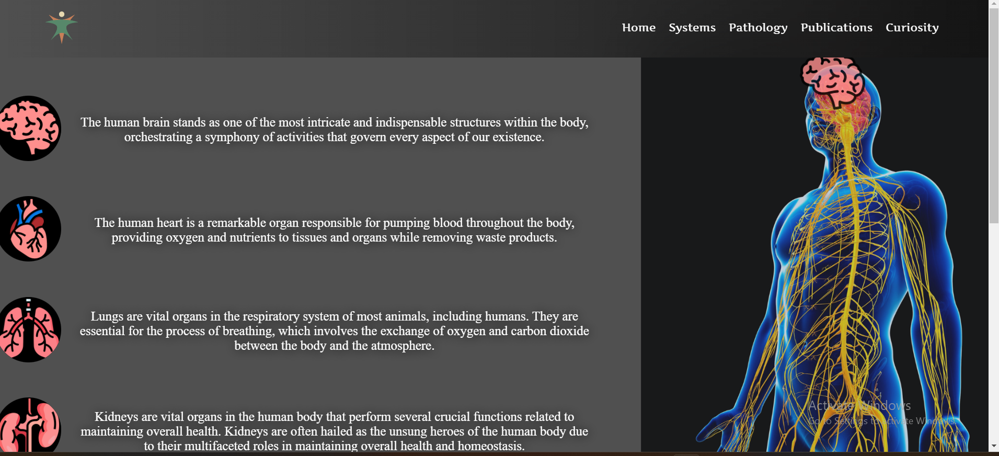
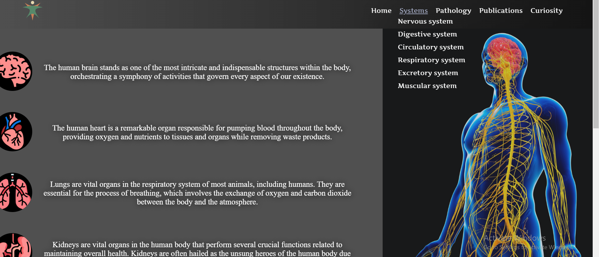
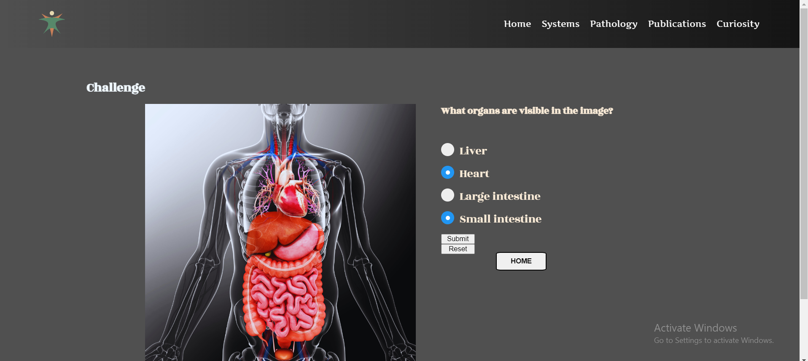

# Human-Body-Webpage
A functional form using JavaScript. 
This is a group project I worked on as homework for my accredited Web Developer Course. My part was implementating a functional form using JavaScript. The user will answer based on an image. I chose to display the answers as radio buttons. When clicking Submit, the user will go on the next quizz. At the end, a message will apper informing the user if he passed or not the challenge. 
I also worked myself on the Systems dropdown submenu and also on the Pathology Page. All my work is Responsive designed.  The rest of the project was my colegues's jobs. 

Here are some SCREENSHOTS to see my project:

